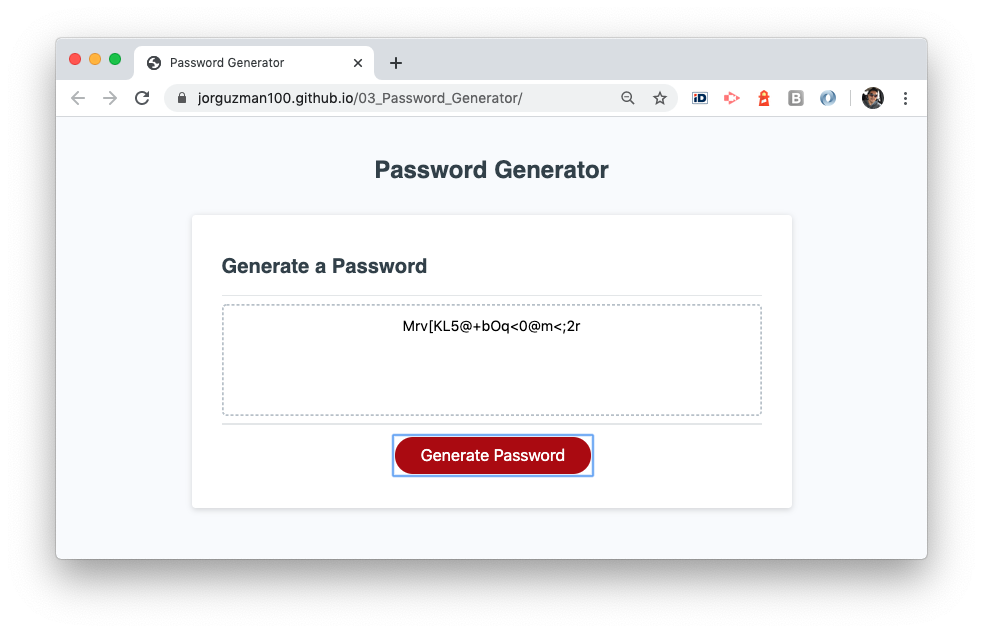

# 03_Password_Generator
An application that generates a random password based on user selected criteria. \
Built with HTML, CSS, and JavaScript.

## The Challenge

It is required to have an application that allows to create a strong password. The application will confirm the following user preferences:

- [x] Password length beetween 8 and 128 characters.
- [x] Lower case characters.
- [x] Upper case characters.
- [x] Numbers.
- [x] Special characters.

Validations:
- [x] Password length user selection should be a number between 8 and 128.
- [x] At least one character type should be selected.

According to user preferences, the password will be generated randomly and shown in the pages's text area.

Additional given characteristics:
This app will run in the browser and feature dynamically updated HTML and CSS powered by your JavaScript code. It will also feature a clean and polished user interface and be responsive, ensuring that it adapts to multiple screen sizes.

## The  development process

In order to accomplish the challenge, the following steps were executed:
1. Understand the challenge and the base-line files provided (HTML, CSS and base JavaScript).
2. Define complementary breakdown pseudo-code.
3. Code each breackdown element.
4. Test, try and error, and apply corrections.
5. Write proper documentation comments to main code parts.

## The Output

With the described process we were able to create a efficient and responsive application that generates passwords according to user's criteria.

__The application__
 

## Installation

The project was uploaded to [GitHub](https://github.com/) at the following repository:
[https://github.com/jorguzman100/03_Password_Generator](https://github.com/jorguzman100/03_Password_Generator)

You can access the deployed application with the GitHup Pages link:
[https://jorguzman100.github.io/03_Password_Generator/](https://jorguzman100.github.io/03_Password_Generator/)

